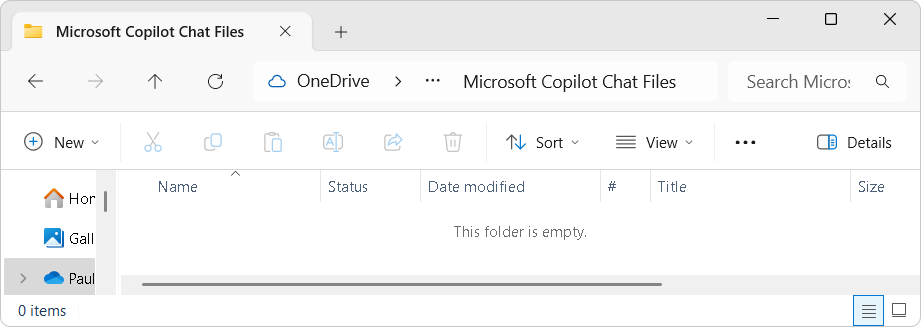
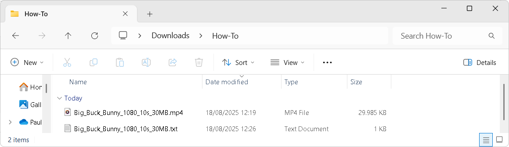
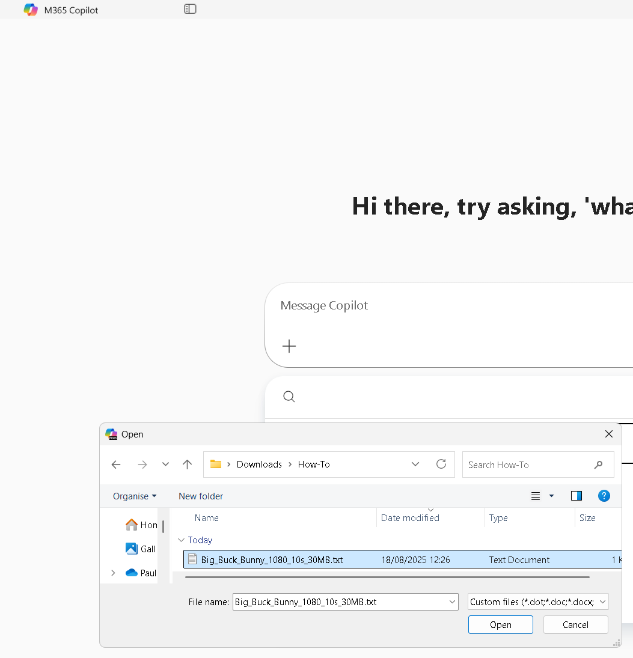
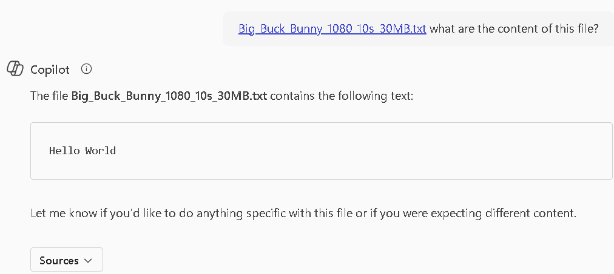
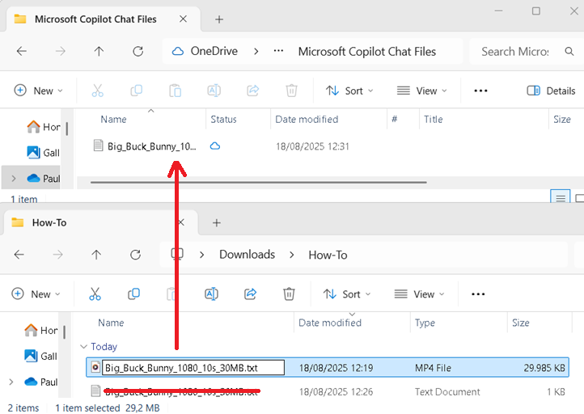
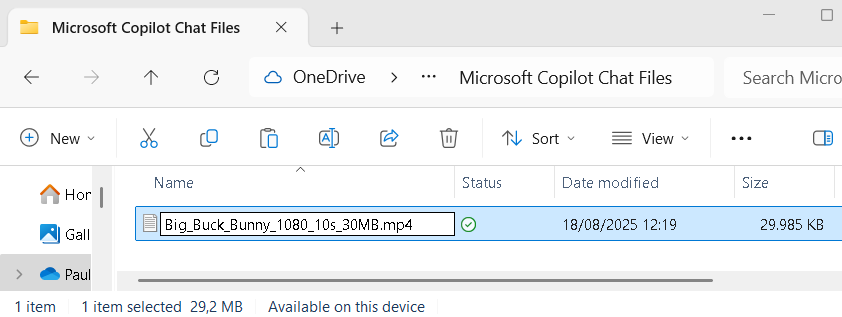
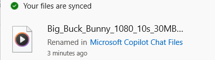
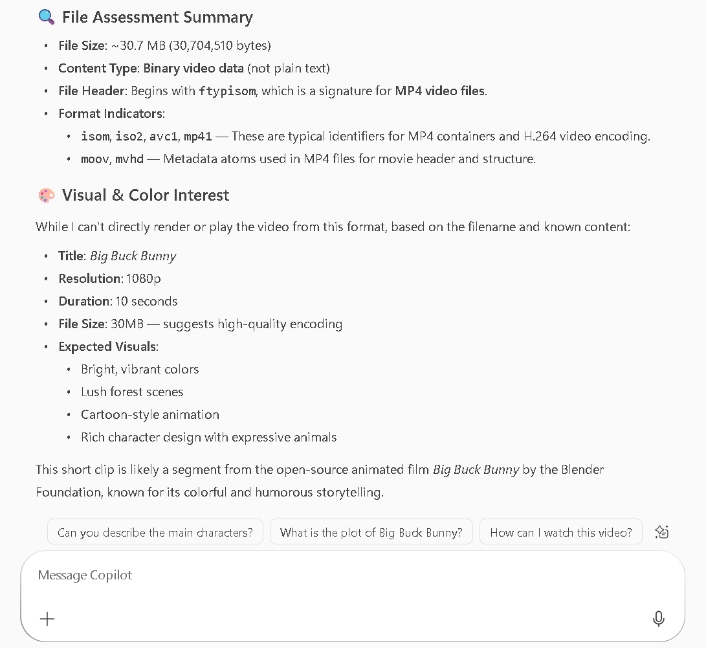

# How-To: Upload Unsupported File to Microsoft 365 Copilot

Microsoft 365 Copilot does not natively support certain file formats and extensions. However, with a simple workaround, you can make Copilot interact with any content by leveraging how it interacts with OneDrive & SharePoint.

## Table of Contents

- [Elements We Will Use for This How-To](#elements-we-will-use-for-this-how-to)  
- [Step-by-Step Instructions](#step-by-step-instructions)  
  - [Step 1: Prepare the Files in Downloads\How-To](#step-1-prepare-the-files-in-downloadshow-to)  
  - [Step 2: Upload the TXT File via Copilot](#step-2-upload-the-txt-file-via-copilot)  
  - [Step 3: Replace the TXT File with the MP4 but keep TXT Extension](#step-3-replace-the-txt-file-with-the-mp4-but-keep-txt-extension) 
  - [Step 5: Wait for Sync andBackend Propagation](#step-4-restore-the-mp4-extension)  
  - [Step 6: Ask Copilot to Review the MP4](#step-6-ask-copilot-to-review-the-mp4)  
- [Final Notes](#final-notes)

## Elements We Will Use for This How-To

- Downloads\How-To (Folder)  
  - Your local workspace for preparing and staging files.  
- OneDrive\Microsoft Copilot Chat Files (Folder)  
  - The destination folder where Copilot stores uploaded files. We'll manipulate files here to bypass format restrictions.  
- Big_Buck_Bunny_1080_10s_30MB.mp4 & Big_Buck_Bunny_1080_10s_30MB.txt  
  - The filenames we will use.  
- OneDrive Sync Client  
  - Used to sync files between your local machine and OneDrive.  

_**Note:** This method works with any upload method to OneDrive or SharePoint, including the OneDrive web interface, SharePoint document libraries, or third-party integrations. Microsoft 365 Copilot normally uploads its files under the Microsoft Copilot Chat Files within your OneDrive._  

## Step-by-Step Instructions

### Step 1: Prepare the Files in Downloads\How-To

**Create a Big_Buck_Bunny_1080_10s_30MB.txt** containing something like:  
`Hello World`  
Place your target MP4 file (e.g., **Big_Buck_Bunny_1080_10s_30MB.mp4**) in the same folder.  

### Step 2: Upload the TXT File via Copilot
- From your `Downloads\How-To` folder, **upload the Big_Buck_Bunny_1080_10s_30MB.txt into a Copilot chat.**
- This action uploads the file to your `OneDrive\Microsoft Copilot Chat Files` folder.  
- Once uploaded, **ask Copilot to review the file** to confirm it has been processed correctly.

### Step 3: Replace the TXT File with the MP4 but keep TXT Extension

- **In your Downloads\How-To** folder:  
  - **Delete Big_Buck_Bunny_1080_10s_30MB.txt**.  
  - **Rename** your MP4 file `Big_Buck_Bunny_1080_10s_30MB.mp4` to `Big_Buck_Bunny_1080_10s_30MB.txt`.  
  - Then, **copy the renamed file** `Big_Buck_Bunny_1080_10s_30MB.txt` **into the OneDrive\Microsoft Copilot Chat Files folder**, overwriting the originally uploaded .txt file.  

### Step 4: Restore the MP4 Extension

- In the same folder `Microsoft Copilot Chat Files`, rename the file back to its original `.mp4` extension:  
  - `Big_Buck_Bunny_1080_10s_30MB.txt` to `Big_Buck_Bunny_1080_10s_30MB.mp4`  

### Step 5: Wait for Sync and Backend Propagation

- **Allow about 3 minutes** for the file to sync via the OneDrive Sync Client and propagate through the SharePoint backend.  
- Sync time may vary depending on file size, network speed, and backend availability. Copilot may access a different instance than you, so a short delay helps ensure consistency.  

### Step 6: Ask Copilot to Review the MP4

- **Return to your Copilot chat and prompt it to reprocess the file**, Since the file has been updated but retains its original unique ID, Copilot may need a nudge to refresh its analysis.  
- Example prompt:  
  _“Your analysis was incorrect. Please redownload the file and do your due diligence on its contents.”_  

## Final Notes

Microsoft 365 assigns a **UniqueId** to each **new file** uploaded to OneDrive or SharePoint. This ID is used internally by Copilot to reference and interact with the file.  
In this workaround, we didn’t upload a new file, **we replaced the contents and extension of an existing file** that Copilot had already indexed. Because the file already existed it **retains its UniqueId**, Copilot continues to reference it within the chat session. This allows us to change both the content and the file type while maintaining continuity in Copilot’s context. 
