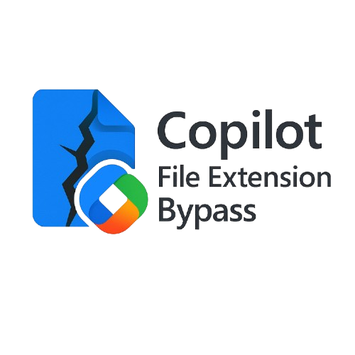

# File Extension Restriction Bypass in Microsoft 365 Copilot
  
**Discovered by:** [Paulus1337](https://github.com/Paulus1337)  
**Disclosed on:** 19 September 2025  
**MSRC Case ID:** 100065  
**Severity (per MSRC):** Moderate  
**Status:** Case complete, disclosure permitted under MSRC Coordinated Vulnerability Disclosure Policy

---

## Background

During an engagement involving ZIP file analysis, I attempted to use Microsoft 365 Copilot to assist with file inspection. However, I encountered upload restrictions that blocked certain file types, including `.zip`. This led me to investigate how Copilot handles file persistence and access.

I discovered that Copilot accesses uploaded files using a persistent **UniqueId** and a **tempauth** token, rather than relying on file extensions or metadata. From prior experience, I knew that modifying a file in SharePoint or OneDrive does not alter its **UniqueId**. 

To test this, I uploaded a `.txt` file and then replaced its contents with a `.zip` archive. Copilot was able to access and describe the contents of the `.zip` file. I further tested this by renaming the file to a disallowed extension such as `.vps`, and Copilot continued to access it without issue. This confirmed that Copilot does not revalidate file extensions or type after upload.

This behavior had not been previously reported and was accepted by MSRC as a new vulnerability submission.

---

## Summary

Microsoft 365 Copilot enforces file extension restrictions only at the time of upload. Once a file is uploaded, it can be modified to a disallowed type (e.g., `.exe`, `.vps`) while retaining its original **UniqueId**. Copilot continues to access and process the file without rechecking its extension or type.

**Key Risk:**  
Files accessed by Copilot (and potentially shared with users) may not be what they appear to be. A file uploaded as `.txt` can later be changed to `.exe`, `.vps`, or any other disallowed format, yet still be treated as safe by Copilot.

---

## Technical Details

- **Upload Enforcement:**  
  Copilot enforces extension restrictions only during the initial upload.

- **Post-Upload Bypass:**  
  After upload, the file can be modified while retaining its original **UniqueId**.

- **Access Mechanism:**  
  Files are accessed via SharePoint/OneDrive URLs such as:  
  [https://example.sharepoint.com/personal/user_example_com/_layouts/15/download.aspx?**UniqueId=12345678-c4e9-45d6-8c5b-fc43f93f8f15**&Translate=false&tempauth=token](#technical-details)  
  - **tempauth** is a JWT token refreshed hourly if Copilot still needs access.  
  - No revalidation occurs when the file is accessed via this URL.  
  - The **download.aspx** endpoint suggests Copilot downloads a copy; sometimes prompting a redownload helps refresh the file.

- **Propagation Delay:**  
  After modifying the file post-upload, it may take 3+ minutes for changes to propagate and become accessible via Copilot, depending on file size.

---

## Design Implications

This is not a flaw in SharePoint or OneDrive themselves, as they offer robust access control mechanisms. The issue stems from how Copilot interacts with these platforms: it relies solely on **UniqueId** and does not revalidate file properties after upload.

While this behavior can be seen as a powerful workaround to extend Copilot’s capabilities beyond documented limits, it also introduces a significant security blind spot. Systems and users may assume a file is safe based on its extension, when in fact it has been altered post-upload.

This technique could also be leveraged in advanced prompt injection scenarios.

**Note (at Upload Time):**  
This issue affects all versions of Microsoft 365 Copilot, including the current public release powered by GPT-5, as Copilot universally relies on SharePoint and OneDrive for file access.  
While the vulnerability was newly disclosed through this report, Microsoft appears to be working on resolving it. As a result, GPT-5 may require additional time before it can detect modified files, or you may need to upload the file directly to OneDrive first for Copilot to access it correctly.

---

## Currently Supported File Formats (at Upload Time)

### Documents
`.doc`, `.docx`, `.docm`, `.dot`, `.xls`, `.xlsx`, `.xlsm`, `.ppt`, `.pptx`, `.ppsm`, `.pdf`, `.rtf`, `.loop`, `.fluid`, `.page`, `.msg`, `.eml`, `.one`, `.whiteboard`

### Text & Markup
`.txt`, `.text`, `.csv`, `.tsv`, `.md`, `.log`, `.html`, `.htm`, `.shtml`, `.shtm`, `.ehtml`, `.xml`, `.json`, `.yaml`, `.yml`, `.ini`, `.config`, `.utf8`

### Code & Scripts
`.aspx`, `.c`, `.cpp`, `.h`, `.java`, `.py`, `.js`, `.jsx`, `.tsx`, `.cs`, `.rs`, `.pl`, `.php`, `.sh`, `.bash`, `.dart`, `.lua`, `.sql`

### Images
`.jpg`, `.jpeg`, `.pjpeg`, `.pjp`, `.jfif`, `.png`, `.bmp`, `.gif`, `.webp`

See: [Microsoft 365 Copilot Supported File Formats](https://support.microsoft.com/en-us/topic/file-formats-supported-by-microsoft-365-copilot-1afb9a70-2232-4753-85c2-602c422af3a8)

**Note:** Anything outside these supported file formats will require the bypass technique described above.

---

## Reproduction

### Step-by-Step Guide

To reproduce the file extension restriction bypass, follow the instructions in the guide:  
- [How-To Guide](How-To)  
This guide currently demonstrates **one example** of the bypass technique.

### Proof-of-Concept (PoC)

See the attached demonstration file:  
- [extension-bypass.pdf](extension-bypass.pdf)  
It showcases how a `.vps` file can be disguised as `.txt` to bypass extension restrictions.

---

## Response from Microsoft

MSRC reviewed the report and classified it as moderate severity. They acknowledged that direct upload of blacklisted extensions is blocked, but the post-upload modification bypass is valid. The issue has been shared with the responsible team for potential future mitigation.

---

## Disclosure Status

- Case marked **Complete** by MSRC  
- No confidentiality requested  
- Disclosure permitted under MSRC policy as of 19 September 2025

**Note:** MSRC uses “Complete” as the final case status. This indicates the case is fully resolved and public disclosure is permitted unless confidentiality was explicitly requested.  
Disclosure also complies with the principles outlined in:

- **SEI/CERT Guide to Coordinated Vulnerability Disclosure** ([PDF](https://www.sei.cmu.edu/documents/1945/2017_003_001_503340.pdf))  
  - Coordinated with the vendor (Microsoft) via MSRC.  
  - Respected the investigation timeline and confidentiality terms.  
  - Disclosed only after resolution, minimizing harm and promoting transparency.

- **ISO/IEC 29147:2018 Vulnerability Disclosure Standard** ([ISO page](https://www.iso.org/standard/72311.html))  
  - Followed a structured reporting process.  
  - Provided technical details and reproduction steps.  
  - Disclosure was coordinated and ethically timed.

**Related documents**  
- [MSRC Coordinated Vulnerability Disclosure Policy](https://www.microsoft.com/en-us/msrc/cvd)  
- [MSRC Blog – What to Expect When Reporting Vulnerabilities](https://msrc.microsoft.com/blog/2023/07/what-to-expect-when-reporting-vulnerabilities-to-microsoft/)
